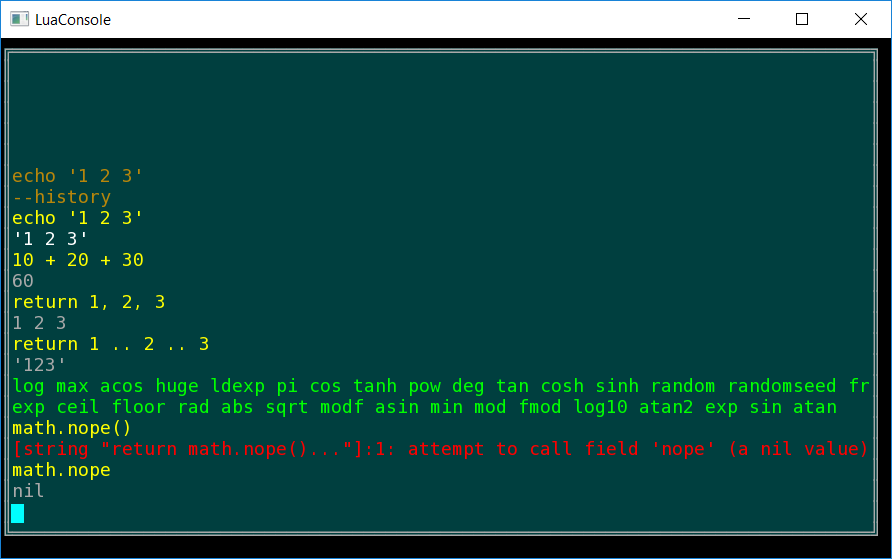
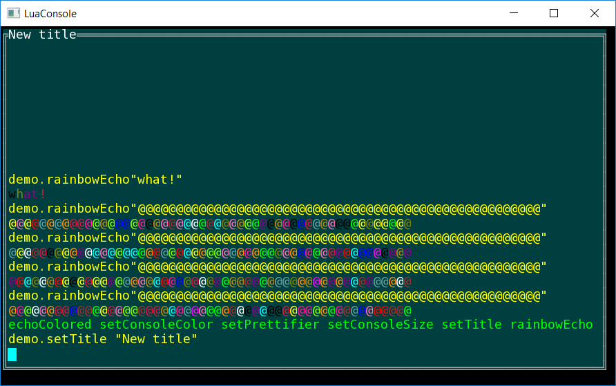
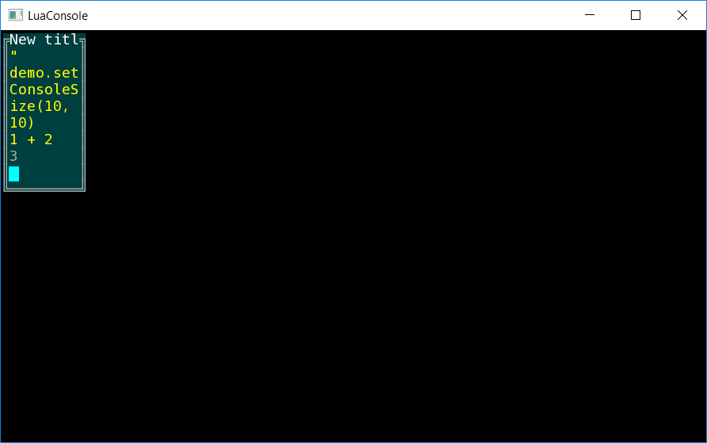
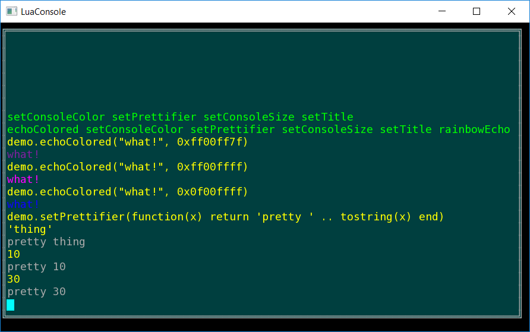

# LuaConsoleProgram
An example program using my LuaConsole lib: [link](https://github.com/FRex/LuaConsole).

Controls are the same as listed in the README there becuase this program uses the SFML input (and display) classes.

Here is a 32 bit Windows exe: [link](https://ln.sync.com/dl/b2b4a5900/dhhqd842-n268qvr8-nq7cgx2c-r55z9jzv).

# Screenshots

